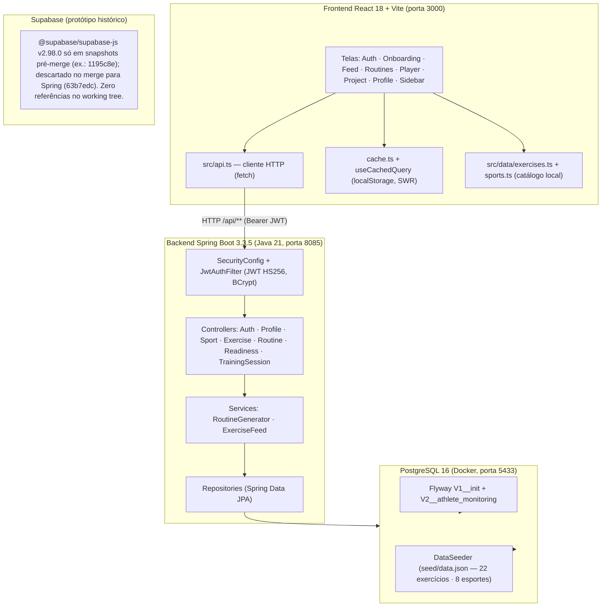

# Estado Atual do Backend — Diagnóstico (Fase 1)

> Data: 2026-08-20 · Método: inspeção direta do repositório (git grep, leitura de código, histórico git, artefatos de build).

## 1. Diagrama da arquitetura atual

## 2. Componentes existentes

| Camada | Componentes |
|---|---|
| Frontend | React 18 + Vite 6 + Tailwind 4 + framer-motion; `src/api.ts` (único cliente HTTP); `src/store.tsx` (contexto global, token JWT, perfil); `src/cache.ts` + `src/hooks/useCachedQuery.ts` (cache SWR própria em localStorage); catálogo local `src/data/*` |
| Backend | Spring Boot 3.3.5 (Java 21), Maven (`backend/pom.xml`), 7 controllers, 2 services, 8 repositories, entidades de domínio, JWT HS256 caseiro (`JwtService`), BCrypt, CORS restritivo |
| Banco | PostgreSQL 16 via Docker (`backend/docker-compose.yml`, porta 5433); Flyway (`V1__init.sql`, `V2__athlete_monitoring.sql`); `DataSeeder` idempotente (`seed/data.json`: 22 exercícios, 8 esportes, pares exercise×sport score 1–5 + rationale) |
| Testes backend | 5 classes, 28 testes (JUnit 5 + Mockito + AssertJ) — unitários, sem contexto Spring |
| Testes frontend | 4 arquivos, 26 testes (Vitest + Testing Library) |
| CI/CD | Inexistente (`.github/` só tem hooks locais de tooling) |
| Documentação | `README.md` (Spring + PostgreSQL), `docs/performance-optimization.md` |

## 3. Endpoints e consumidores

### Públicos (sem JWT) — 5

| Método/rota | Consumidor | Notas |
|---|---|---|
| POST `/api/auth/register` | `Auth.tsx` | validação `@Valid` (email, senha ≥ 8) |
| POST `/api/auth/login` | `Auth.tsx` | 401 sem corpo |
| GET `/api/sports` | `Routines.tsx` (via cache) | catálogo ordenado por nome |
| GET `/api/exercises/feed?sportIds=&q=&category=` | **não consumido** | feed ranqueado (bestScore/strongCount) |
| GET `/api/exercises/{id}` | **não consumido** | detalhe + steps + links |

### Privados (JWT obrigatório) — 14

| Método/rota | Consumidor |
|---|---|
| GET/PUT `/api/me` | `store.tsx` (me/saveProfile) |
| GET/PUT `/api/readiness/today` | `ReadinessCard.tsx` |
| GET `/api/routines` · POST `/api/routines/generate` | `Routines.tsx` |
| POST `/api/routines/{id}/items` · PATCH `/api/routines/{id}/items/{exerciseId}` · DELETE `/api/routines/{id}` | `Routines.tsx` (parcial) |
| POST `/api/routines/{routineId}/sessions` · GET `/api/sessions` · POST `/api/sessions/{id}/start` · PATCH `/api/sessions/{id}` · PATCH `/api/sessions/{id}/items/{exerciseId}` | `Routines.tsx` (sessão em execução) |

## 4. Fluxos principais de dados

- **Autenticação:** `Auth.tsx` → POST `/api/auth/login|register` → `JwtService.issue(sub=email)` → token guardado em `localStorage("forja:token:v1")`; `store.tsx` busca `/api/me` (com cache SWR 5min) e hidrata o perfil no inicializador.
- **Perfil/Onboarding:** `Onboarding.tsx` → PUT `/api/me` (esportes + nível) → invalida cache `/me/`.
- **Feed:** `Feed.tsx` monta a lista **localmente** (`EXERCISES` + `rankFor`) — a regra de ranqueamento do backend (`ExerciseFeedService`) **não é consumida**.
- **Rotinas:** `Routines.tsx` → GET `/api/routines` (cache 2min) + POST `/api/routines/generate` (invalida `/routines/`).
- **Sessão:** `Routines.tsx` → POST `/api/routines/{id}/sessions` → POST `/api/sessions/{id}/start` → PATCH items/patch de conclusão.
- **Readiness:** `ReadinessCard.tsx` → GET/PUT `/api/readiness/today` (cache 2min).
- **Logout/login novo:** `store.tsx` chama `clearCache()` — dados privados são removidos do localStorage.

## 5. Fonte de verdade por domínio

| Domínio | Fonte oficial | Duplicado em |
|---|---|---|
| Catálogo de exercícios/esportes + relevância (score 1–5) | **PostgreSQL** (seed `data.json` + `exercise_sport`) | **`src/data/exercises.ts` + `sports.ts`** (cópia local de 22 exercícios; usada por Feed, Player, Profile, Project, Onboarding, Sidebar) |
| Regra de ranqueamento do feed | **`ExerciseFeedService`** (bestScore/strongCount) | **`rankFor`/`bestLink` em `src/data/exercises.ts`** (regra duplicada no frontend) |
| Usuário, perfil, esportes escolhidos | PostgreSQL (`app_user`, `user_sport`) | — (perfil em localStorage é cache derivado) |
| Rotinas e prescrições | PostgreSQL (`routines`, `routine_items`) | — |
| Sessões de treino executadas | PostgreSQL (`training_sessions*`) | — |
| Readiness (check-in diário) | PostgreSQL (`readiness_checkins`) | — |

## 6. Duplicidades identificadas

1. **Catálogo exercise×sport em duas fontes** (DB curado vs. `src/data/*`), com a **regra de ranqueamento duplicada** (`rankFor`/`bestLink` no frontend vs. `ExerciseFeedService` no backend) — risco real de divergência de regra de negócio.
2. **Supabase × Spring:** duplicidade histórica já resolvida na prática — o protótipo Supabase (`@supabase/supabase-js@^2.98.0`, snapshots `7b8ef47`, `1195c8e`, `f5a0e58`, `a330a5f`) foi descartado no commit `63b7edc` em favor do Spring. **Não existe código, config, schema ou policy Supabase no repositório atual** (grep = 0 em todo o working tree e `package-lock.json`).

## 7. Riscos técnicos e de segurança

| Risco | Severidade | Detalhe |
|---|---|---|
| Sem tratamento global de exceções | Alta | `IllegalArgumentException` → 500; `NoSuchElementException` → 500; 401/403 sem corpo padronizado; frontend não consegue mostrar erro amigável consistente |
| `@Valid` ausente em `RoutineController.generate`/`addItem` | Média | Payload com `sportId`/`exerciseId` nulos não validado |
| Feed com regra de negócio duplicada e obsoleta no frontend | Média | `src/data/*` divergirá do catálogo oficial com o tempo |
| Sem OpenAPI/Swagger | Média | Contrato da API não documentado nem gerado |
| Sem CI/CD | Média | Nenhuma validação automática em push/PR |
| JWT caseiro (HS256 manual) | Baixa | Adequado ao tamanho do projeto; secret via env; TTL 720min configurável; sem refresh token |
| Erros LSP de lombok no editor (backend) | Baixa | Pré-existentes; não afetam `mvn` |

## 8. Dependências entre frontend, Supabase e Spring

- Frontend → **Spring**: única integração HTTP (todos os fluxos via `src/api.ts`).
- Frontend → **Supabase**: inexistente.
- Spring → **PostgreSQL**: único banco (JPA + Flyway).
- Isolamento por usuário: feito na **camada de aplicação** (controllers filtram por `auth.getName()`/ownership — `ownedRoutine`, `findByIdAndUserId`) — não há RLS (V1__init.sql documenta essa decisão).

## 9. Endpoints/tabelas/serviços a preservar

- **Endpoints (19):** todos acima — auth (2), sports (1), exercises (2), me (2), readiness (2), routines (5), sessions (5).
- **Tabelas (12):** `sports`, `exercises`, `exercise_muscles`, `exercise_steps`, `exercise_sport`, `app_user`, `user_sport`, `routines`, `routine_items`, `readiness_checkins`, `training_sessions`, `training_session_items` — gerenciadas por Flyway (V1, V2).
- **Serviços:** `RoutineGeneratorService` (presets por categoria), `ExerciseFeedService` (feed ranqueado), `JwtService`, `DataSeeder`.
- **A consumir de forma nova:** `GET /api/exercises/feed` e `GET /api/exercises/{id}` (existem e são testados, mas o frontend não os usa) — alvo da consolidação (Fase 3).